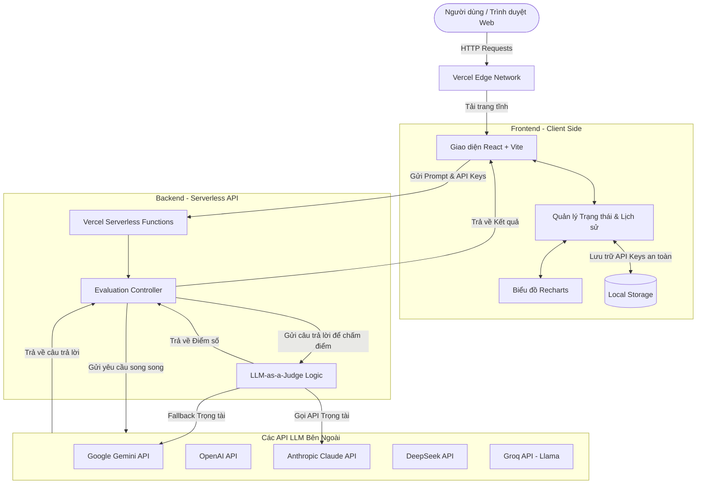
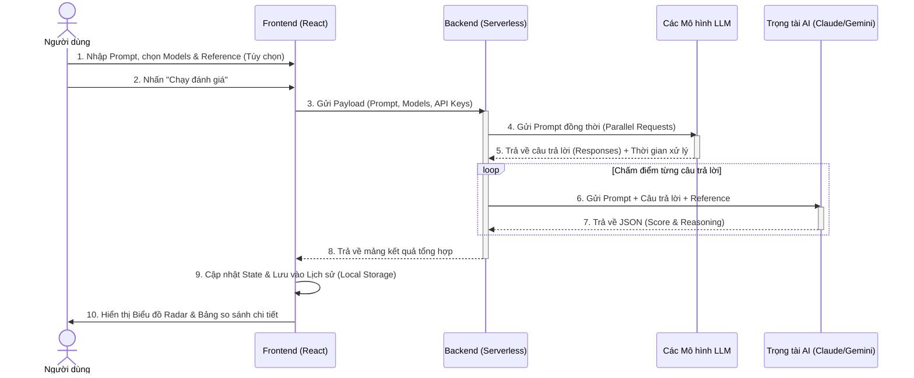

# 🎓 Đồ án: AI Nexus Evaluation Platform

**Nền tảng Đánh giá & So sánh Mô hình Ngôn ngữ Lớn (LLM)**

---

## 🌐 Trải nghiệm trực tuyến (Live Demo)

Dự án đã được triển khai hoàn chỉnh trên môi trường web. Người dùng **không cần tải về hay cài đặt bất kỳ phần mềm nào**, chỉ cần truy cập vào đường link bên dưới để sử dụng trực tiếp:

👉 **[Truy cập AI Nexus Evaluation Platform tại đây](https://your-project-name.vercel.app)**  
*(Lưu ý: Thay thế đường link trên bằng URL Vercel thực tế của bạn)*

---

## 📖 Bối cảnh & Mục tiêu đồ án

Trong bối cảnh Trí tuệ Nhân tạo (AI) và các Mô hình Ngôn ngữ Lớn (LLM) phát triển bùng nổ, người dùng và các nhà phát triển gặp khó khăn trong việc lựa chọn mô hình phù hợp nhất cho nhu cầu của mình. Mỗi mô hình (Gemini, ChatGPT, Claude, DeepSeek...) đều có ưu/nhược điểm riêng về độ chính xác, tốc độ và chi phí.

**Mục tiêu của đồ án:**
Xây dựng một nền tảng web tập trung, cho phép người dùng gửi cùng một câu hỏi (prompt) đến nhiều LLM khác nhau cùng lúc. Sau đó, hệ thống sẽ sử dụng một **Trọng tài AI (LLM-as-a-Judge)** để tự động chấm điểm, phân tích và trực quan hóa kết quả, giúp người dùng đưa ra quyết định lựa chọn mô hình tối ưu nhất một cách khách quan.

---

## 🏗️ Sơ đồ Kiến trúc Hệ thống (Architecture Diagram)

Hệ thống được thiết kế theo kiến trúc **Serverless Full-Stack**, tối ưu hóa cho việc triển khai trên Vercel, đảm bảo tốc độ phản hồi nhanh và khả năng mở rộng tốt.

---

## ⚙️ Sơ đồ Luồng xử lý Logic (Logic Flow Diagram)

Dưới đây là sơ đồ tuần tự mô tả luồng xử lý cốt lõi của hệ thống khi người dùng thực hiện một yêu cầu đánh giá:

---

## 🛠️ Các bước thực hiện đồ án

Để hoàn thành đồ án này, quá trình phát triển được chia thành các giai đoạn cụ thể:

### Bước 1: Khảo sát & Phân tích yêu cầu
- Nghiên cứu các phương pháp đánh giá LLM hiện tại (Human eval vs. LLM-as-a-Judge).
- Xác định các tiêu chí đánh giá cốt lõi: Điểm số chất lượng, Thời gian phản hồi (Latency), và Chi phí ước tính.
- Quyết định không lưu trữ API Key của người dùng trên database để đảm bảo tính bảo mật tuyệt đối (chỉ lưu ở Local Storage).

### Bước 2: Thiết kế Giao diện (UI/UX)
- Sử dụng **Tailwind CSS** để xây dựng giao diện hiện đại, tối giản và thân thiện.
- Thiết kế các component chính: Khu vực nhập Prompt, Bảng chọn Mô hình, Biểu đồ Radar so sánh, và Bảng chi tiết kết quả.
- Tích hợp **Lucide React** cho hệ thống icon trực quan.

### Bước 3: Phát triển Backend & Tích hợp API
- Xây dựng API trung gian bằng **Express.js** (sau này chuyển đổi thành Vercel Serverless Functions).
- Viết các adapter để kết nối với nhiều nhà cung cấp API khác nhau:
  - `@google/genai` cho Gemini.
  - `fetch` API chuẩn cho OpenAI, Anthropic, DeepSeek, và Groq.
- Xử lý lỗi (Error Handling) để đảm bảo nếu một mô hình bị lỗi (ví dụ: sai API Key), các mô hình khác vẫn trả về kết quả bình thường.

### Bước 4: Cài đặt thuật toán Trọng tài AI (LLM-as-a-Judge)
- Viết System Prompt chuyên biệt để biến một LLM thành giám khảo khách quan.
- Cấu hình ưu tiên sử dụng **Claude 3.5 Sonnet** làm trọng tài do khả năng suy luận logic xuất sắc.
- Xây dựng cơ chế **Fallback**: Nếu người dùng không có API Key của Claude, hệ thống tự động chuyển sang dùng **Gemini** làm trọng tài thay thế.
- Ép kiểu dữ liệu trả về của Trọng tài dưới dạng `JSON` (gồm `score` và `reasoning`) để Backend dễ dàng parse và xử lý.

### Bước 5: Trực quan hóa dữ liệu & Quản lý trạng thái
- Tích hợp thư viện **Recharts** để vẽ biểu đồ Radar, giúp người dùng nhìn nhận đa chiều về sức mạnh của từng mô hình.
- Cài đặt tính năng lưu trữ Lịch sử đánh giá vào `localStorage`, cho phép người dùng xem lại các bài test cũ mà không cần gọi lại API.
- Thêm tính năng xuất dữ liệu ra file CSV phục vụ cho việc làm báo cáo.

### Bước 6: Kiểm thử & Triển khai (Deployment)
- Tối ưu hóa mã nguồn, loại bỏ các thư viện không cần thiết.
- Cấu hình file `vercel.json` để định tuyến chính xác các request `/api/*` vào Serverless Functions.
- Triển khai toàn bộ dự án lên nền tảng **Vercel**, đảm bảo ứng dụng hoạt động mượt mà trên môi trường Internet thực tế.

---

## 💻 Công nghệ sử dụng

- **Frontend:** React 18, Vite, Tailwind CSS, Recharts, Framer Motion (hiệu ứng).
- **Backend:** Node.js, Express, Vercel Serverless Functions.
- **AI Integration:** Google GenAI SDK, REST APIs (OpenAI, Anthropic, DeepSeek, Groq).
- **Hosting & CI/CD:** Vercel.

---

## 📚 Hướng dẫn sử dụng cho người dùng cuối

Vì hệ thống đã được triển khai trên web, bạn chỉ cần thực hiện các bước đơn giản sau:

1. **Truy cập Website:** Mở đường link ứng dụng trên trình duyệt (hỗ trợ cả PC và Mobile).
2. **Cấu hình API Key:** 
   - Nhấn vào biểu tượng **Bánh răng (Settings)** ở góc phải màn hình.
   - Nhập API Key của các mô hình bạn muốn thử nghiệm (Key của bạn được an toàn tuyệt đối, chỉ lưu trên trình duyệt của bạn).
3. **Nhập Yêu cầu (Prompt):** Điền câu hỏi hoặc bài toán bạn muốn các AI giải quyết.
4. **Đáp án chuẩn (Tùy chọn):** Nếu có đáp án mẫu, hãy nhập vào ô "Đáp án tham chiếu" để Trọng tài chấm điểm chính xác hơn.
5. **Chọn Mô hình:** Tick chọn các mô hình bạn muốn đưa lên "bàn cân".
6. **Đánh giá:** Nhấn nút **"Chạy đánh giá"**. Hệ thống sẽ xử lý và hiển thị biểu đồ Radar cùng bảng phân tích chi tiết ngay bên dưới.

---
*Đồ án được thực hiện với sự tập trung cao độ vào trải nghiệm người dùng, tính thực tiễn và áp dụng các công nghệ Web & AI hiện đại nhất.*
